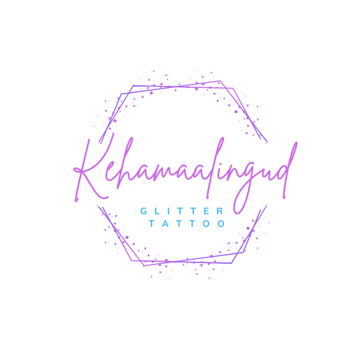

<!DOCTYPE html>
<html lang="en">

<head>
    <meta charset="UTF-8">
    <meta name="viewport" content="width=device-width, initial-scale=1.0">
    <meta name="description" content="Tegeleme Tallinnas glitter tattoode maalimisega.">
    <meta name="keywords" content="kehamaalingud, glitter tattoo, näomaalingud, laste pidu, laste sünnipäev, festival, näomaalingud Tallinnas, glitter tattoo tallinn, ">
    <title>Glitter tattoo</title>

    <!-- Bootstrap CSS -->
    <link href="https://stackpath.bootstrapcdn.com/bootstrap/4.3.1/css/bootstrap.min.css" rel="stylesheet">

    <!-- Custom CSS -->
    
</head>

<body>

    <header>
        <h1>Glitter tattood</h1>
    </header>
<nav>
    

        <a href="/">Avaleht</a>
        <a href="/">Teenused</a>
        <a href="/">Kontakt</a>
    

</nav>

    <section>
        

        

            <h2>OÜ Kehamaalingud</h2>
            
Tere tulemast meie veebilehele, kus kunst ja keha sulavad ühte, luues unustamatuid hetki ja väljendusi läbi kehamaalingute ja sädelevate tatoveeringute! Oleme pühendunud sellele, et tuua teie kehale elu ja värvi ning muuta iga hetk eriliseks.
Meie kunstnikud on kogenud ja kirglikud professionaalid, kes on spetsialiseerunud erinevatele stiilidele ja lähenemisviisidele. Olgu tegemist delikaatsete lilledega, julgete geomeetriliste mustritega või sädelevate elementidega, meie meeskond suudab rahuldada ka kõige unikaalsemaid maitseid ja soove.
Kasutame vaid kvaliteetseid ja ohutuid materjale, tagamaks kehamaalingute püsivust ja heaolu. Lisaks pakume laia valikut sädelevaid tatoveeringuid, mis annavad teie kehale glamuurse sära ja erilise sädeluse. Meie sädelevad tatoveeringud on ajatu viis eneseväljenduseks ning sobivad suurepäraselt nii igapäevaseks stiiliks kui ka erilisteks sündmusteks.
Oleme loonud selle veebilehe, et inspireerida ja jagada meie kirge keha kunsti vastu. Läbi meie portfoolio saate näha meie varasemaid töid ning leida inspiratsiooni enda järgmiseks kehamaalinguks või tatoveeringuks. Lisaks jagame kasulikke näpunäiteid ja juhiseid keha kunsti hooldamiseks, et tagada teie kunstiteose püsiv ilu.
Ühinege meiega teekonnal eneseväljenduse ja kunsti maailma ning laske meil tuua teie kehale elu ja sära! Tutvuge meie teenuste ja kunstnikega ning võtke julgelt ühendust, et alustada oma unikaalse kehamaalingu või sädeleva tatoveeringu loomise teekonda.
Tere tulemast meie laste pidude imelisse maailma, kus iga hetk muutub seikluseks ja iga naeratus säraoksjoniks! Oleme siin, et muuta teie laste pidu veelgi erilisemaks ja unustamatuks, tuues sisse lõbusad ja loomingulised kehamaalingud, mis rõõmustavad nii väikeseid kui suuri.
Meie professionaalsed kehamaalingu kunstnikud on spetsialiseerunud laste lõbusatele ja fantaasiarikastele kujunditele. Olgu tegemist värviliste liblikate, säravate tähtede või armsate loomakestega - me suudame muuta igast lapse näost väikese kunstiteose. Kasutame ainult lastesõbralikke, allergiavabu ja kergesti maha pestavaid värve, et tagada nii lastele kui ka vanematele meelerahu.
Meie veebilehel saate tutvuda meie varasemate töödega, saades inspiratsiooni ja ideid teie lapse peo jaoks. Lisaks pakume erinevaid teemapakette vastavalt teie pidu iseloomule - olgu selleks siis printsesside, superkangelaste või loomade teema. Meie eesmärk on pakkuda mitmekülgset ja meelelahutuslikku kogemust, kus kehamaalingud on vaid üks osa suuremast pidulikust seiklusest.
Liituge meiega laste lõbu ja naeru maailmas ning laske meil tuua lisavärv ja sära teie peole! Tutvuge meie teenuste ja kunstnikega ning võtke julgesti ühendust, et planeerida oma lapse järgmine sünnipäevapidu täis kehamaalingute lõbu ja loomingulisust.

        

        

            
        

    </section>

    <footer>
        
&copy; 2023 Your Website. All rights reserved.

    </footer>

    <!-- Bootstrap JS and dependencies (popper.js and jQuery) -->
    
    
    

</body>

</html>
